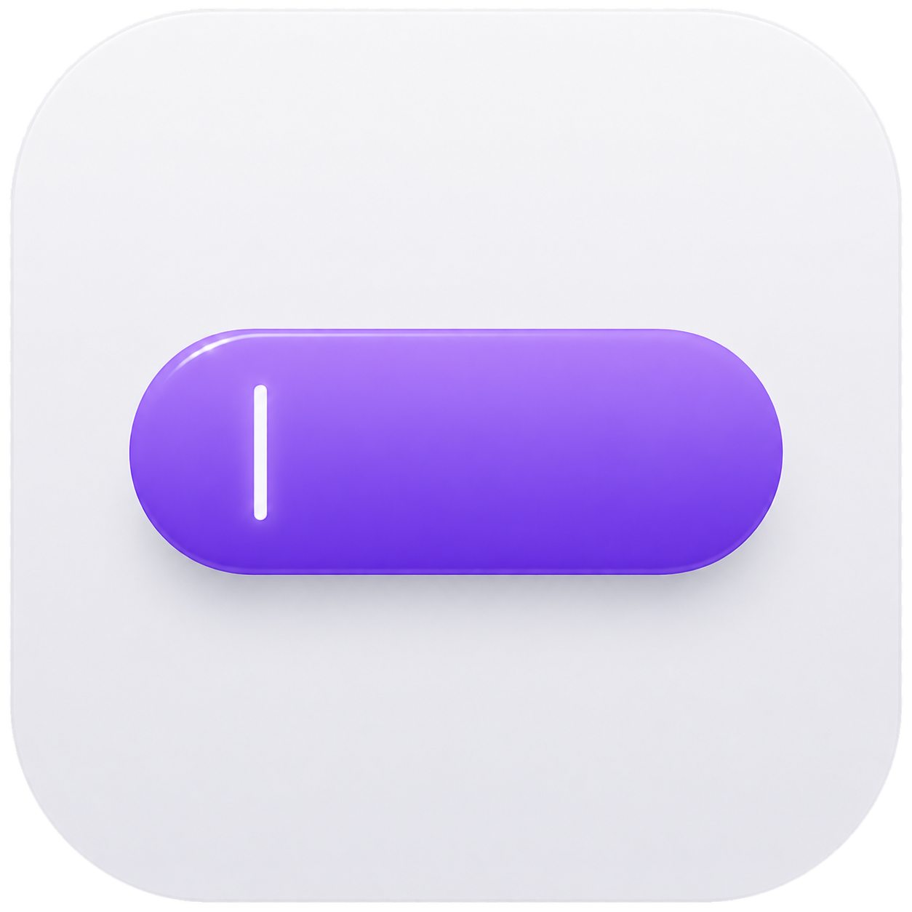
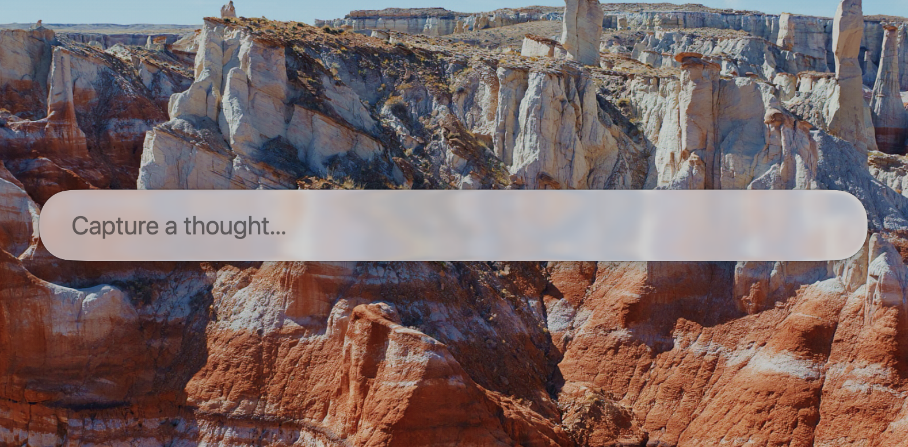

<p align="center">
  
</p>

<h1 align="center">Capture</h1>

<p align="center">
  <a href="#install"></a>
  <a href="LICENSE"></a>
  <a href="https://github.com/charlesbeaumont/capture-launcher/releases"></a>
</p>

A tiny macOS menu-bar app. Press a global hotkey, a Spotlight-style glass bar opens, type a thought, hit Enter, the text is fired at a configurable URI scheme (default: Bear's `bear://x-callback-url/add-text` to prepend a timestamped block to a pinned "Inbox" note).

Single purpose. No history, no recents, no fuzzy search, no plugins, no main window, no Dock icon. Lives entirely in the menu bar.

<p align="center">
  
</p>

## Install

### Download (recommended)

1. Grab the latest `Capture-vX.Y.Z.zip` from [Releases](https://github.com/charlesbeaumont/capture-launcher/releases).
2. Unzip and drag `Capture.app` to `/Applications`.
3. First launch: **right-click → Open**, then confirm. Capture is ad-hoc signed (no paid Apple Developer account behind it), so Gatekeeper asks once. After that it opens normally.

### Build from source

Requirements: macOS 26 Tahoe, Xcode 26+, [XcodeGen](https://github.com/yonaskolb/XcodeGen).

```bash
brew install xcodegen
xcodegen generate
open Capture.xcodeproj
```

Then ⌘R in Xcode. No Dock icon — look in the menu bar for the brain glyph.

For tight iteration without Xcode, `./scripts/dev.sh` watches `Sources/` and `project.yml` and rebuilds + relaunches Capture on every save (needs `brew install fswatch`).

## Behavior

| Action | Result |
|---|---|
| `⌃⌘Space` | Toggle the bar |
| `Enter` | Send the capture and close |
| `Shift+Enter` | Insert a newline |
| `Esc` | Close without sending |

The bar persists when focus shifts elsewhere — it only hides on Esc, Enter, or another hotkey press. Multi-line input grows the bar downward up to 5 lines, then scrolls internally.

## Configuration

Click the brain in the menu bar → **Settings…** (or ⌘, while the menu is open).

The only setting is the **URI template** that's opened on Enter. Default:

```
bear://x-callback-url/add-text?id=<note-id>&mode=prepend&open_note=no&show_window=no&text=**{datetime}**%0A{content}%0A
```

Four placeholders, all strictly URL-encoded (`.alphanumerics`) on substitution:

- `{content}` — captured text
- `{time}` — current time as `HH:mm`
- `{date}` — current date as `yyyy-MM-dd`
- `{datetime}` — `yyyy-MM-dd HH:mm`

The default **prepends** a block like the following to your Bear "Inbox" note (newest on top), without bringing Bear forward:

```
**2026-06-15 21:30**
my thought

```

Edit the `id=` value to target a different Bear note, or swap the template entirely to ship captures wherever you want.

## Hotkey

Default is `⌃⌘Space`. To change it, edit `Sources/HotkeyName.swift`:

```swift
static let toggleLauncher = Self(
    "toggleLauncher",
    default: .init(.space, modifiers: [.command, .control])
)
```

(A future iteration can expose a `KeyboardShortcuts.Recorder` UI in Settings if rebinding becomes a frequent need.)

## Project layout

```
project.yml                 XcodeGen spec — single source of truth for the Xcode project
Sources/
  CaptureApp.swift          @main App + MenuBarExtra + Settings scene
  AppDelegate.swift         activation policy, hotkey, panel lifecycle, fade animations
  LauncherPanel.swift       NSPanel subclass (non-activating overlay)
  LauncherView.swift        SwiftUI input view with .glassEffect, multi-line growth
  DailyCapture.swift        URI template substitution + NSWorkspace.open
  HotkeyName.swift          KeyboardShortcuts.Name.toggleLauncher
  SettingsView.swift        URI template editor
  Info.plist                LSUIElement=true, bundle metadata
scripts/
  dev.sh                    fswatch → rebuild Debug → relaunch
  release.sh                build Release zip for GitHub Releases
```

The `.xcodeproj` is generated by XcodeGen and gitignored. Regenerate after editing `project.yml` or adding/removing source files:

```bash
xcodegen generate
```

## License

[MIT](LICENSE).
